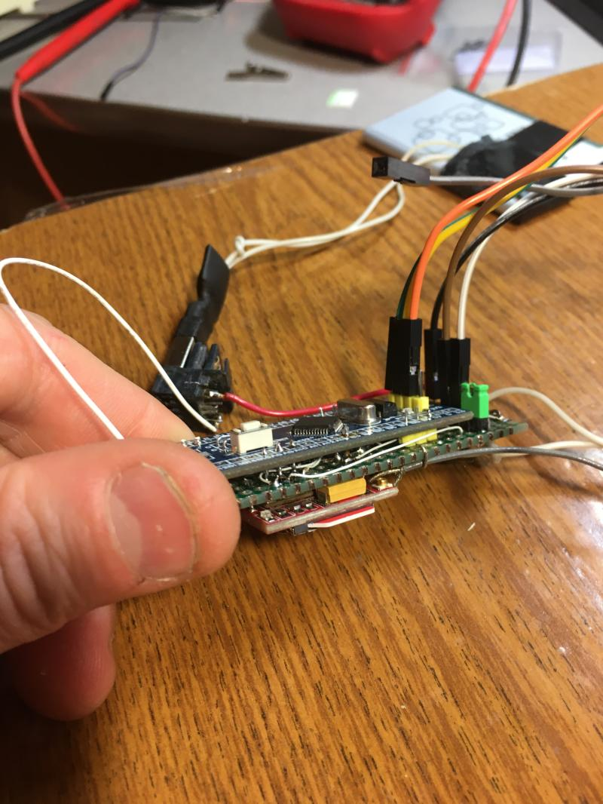
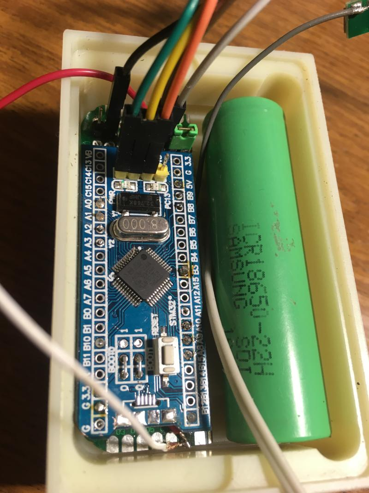

# Horse_Rental_Tracker
Smart wearable device for time measuring in horse renals

Based by STM32F103C8 board and GSM SIM800L board. Without HAL using

There using: method charge moving of capacity sensor

AT-command communications with SIM800L module

EMAIL with SSL send by SIM800L

Voice menu, DTMF decoding, SMS parsing , time syncronisation with NTP, sleep mode

